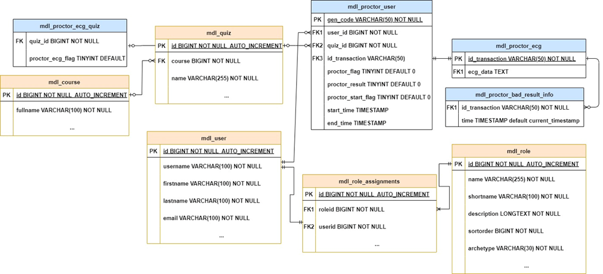

# moodle_proctor_ecg_system
Данный проект представляет выпускную квалификационную работу (ВКР) Гиндуллиной Динары Рафисовны.
moodle_proctor_ecg_system -- модуль для образовательной системы moodle, который обеспечивает непрерывную идентификацию пользователей во время прокторинга.
Модуль содержит:
- server
- app
- moodle
- Прочие папки являются необязательными.
### server
Папка содержит программу сервера ECG Proctor Server, обеспечивающего бизнес-логику приложения (общение между ECG Proctor Server и Moodle Server, между ECG Proctor Server и Desktop App и непрерывную идентификацию по данным ЭКГ).
Для работы необходимо создать таблицы в базе данных moodle. Ниже даталогическая схема для таблиц необходимых в работе приложения (синие -- созданные таблицы, оранжевые -- таблицы moodle)

### app
Десктопное приложение необходимое для получения ЭКГ и передачи его серверу.
### moodle
В папке находятся файлы, которые необходимо положить в код сервера moodle.
### e2e_tests
Интеграционные тесты на cypress
### model
Код сиамской нейронной сети, которая применяется для идентификации по данным ЭКГ на сервере.
### Установка и запуск
#### server
Скачайте папку server и установите все необходимые библиотеки из requirements.txt
Для запуска:
- python manage.py runserver
#### app
Скачайте папку app и установите все необходимые библиотеки из requirements.txt
Для запуска:
- python main.py
Для сборки:
- pyinstaller --noconsole --onefile --collect-data TKinterModernThemes --collect-data PIL .\main.py
#### moodle
Все папки расположить в исходниках moodle.
- Папку proctor_ecg расположить в папке moodle/
- Папку slack в moodle/blocks
- В папке change_files файлы, в которые были добавлены блоки кода. Измененные файлы находятся в moodle/mod/quiz. 
- В файл moodle/config.php добавить $CFG->wwwproctorecg = 'http://localhost:8000' ; (расположение сервера ECG Proctor Server).
#### e2e_tests
- npm run cypress
#### model
Скачайте папку model и установите все необходимые библиотеки из requirements.txt